# bStats Graph

Static statistics cards for [bStats](https://bstats.org) plugins and platforms,
generated by a scheduled GitHub Action and embedded in this README.

The cards are plain SVG files in dark and light versions, and need no external service
to display. Each card comes with a copyable snippet for use in other READMEs.

## Example

<!-- BSTATS-GRAPHS:START -->

### PendingWhitelist

**Dark**

<p align="center"><a href="https://bstats.org/plugin/bukkit/PendingWhitelist/33884"></a></p>

```markdown
[](https://bstats.org/plugin/bukkit/PendingWhitelist/33884)
```

**Light**

<p align="center"><a href="https://bstats.org/plugin/bukkit/PendingWhitelist/33884"></a></p>

```markdown
[](https://bstats.org/plugin/bukkit/PendingWhitelist/33884)
```

<details>
<summary><b>Automatic theme</b></summary>

Follows the viewer's light or dark setting:

```markdown
[](https://bstats.org/plugin/bukkit/PendingWhitelist/33884)
```

Switches with the GitHub theme:

```html
<a href="https://bstats.org/plugin/bukkit/PendingWhitelist/33884">
  <picture>
    <source media="(prefers-color-scheme: dark)" srcset="https://raw.githubusercontent.com/DarkSpirit006/bStats-Graph/main/docs/bstats/33884-dark.svg">
    <source media="(prefers-color-scheme: light)" srcset="https://raw.githubusercontent.com/DarkSpirit006/bStats-Graph/main/docs/bstats/33884-light.svg">
    
  </picture>
</a>
```

</details>

### TimezoneManager

**Dark**

<p align="center"><a href="https://bstats.org/plugin/bukkit/TimezoneManager/34335"></a></p>

```markdown
[](https://bstats.org/plugin/bukkit/TimezoneManager/34335)
```

**Light**

<p align="center"><a href="https://bstats.org/plugin/bukkit/TimezoneManager/34335"></a></p>

```markdown
[](https://bstats.org/plugin/bukkit/TimezoneManager/34335)
```

<details>
<summary><b>Automatic theme</b></summary>

Follows the viewer's light or dark setting:

```markdown
[](https://bstats.org/plugin/bukkit/TimezoneManager/34335)
```

Switches with the GitHub theme:

```html
<a href="https://bstats.org/plugin/bukkit/TimezoneManager/34335">
  <picture>
    <source media="(prefers-color-scheme: dark)" srcset="https://raw.githubusercontent.com/DarkSpirit006/bStats-Graph/main/docs/bstats/34335-dark.svg">
    <source media="(prefers-color-scheme: light)" srcset="https://raw.githubusercontent.com/DarkSpirit006/bStats-Graph/main/docs/bstats/34335-light.svg">
    
  </picture>
</a>
```

</details>

<!-- BSTATS-GRAPHS:END -->

## Features

- Server and player history with per-link time ranges, independent scales and change indicators
- Version, platform and country breakdowns picked from the charts each page provides
- Works with plugin pages and global pages (Bukkit, BungeeCord, Velocity, Sponge, ...)
- Dark, light and auto-switching versions of every card
- Copyable Markdown under each card, pointing at the raw files of whichever repository runs it
- Nothing tied to one repository: host, owner, branch and paths are detected at run time
- One bStats URL per line, with an optional time range; no API keys or IDs to configure
- Python standard library only

## Usage

1. Fork this repository, or copy `scripts/generate_bstats_graph.py`,
   `.github/workflows/update-graphs.yml` and `bstats-plugins.txt` into any repository.
2. Add the bStats pages you want to `bstats-plugins.txt`, one URL per line:

   ```text
   https://bstats.org/plugin/bukkit/PendingWhitelist/33884 1w
   https://bstats.org/global/bukkit
   ```

   Append a range token to set the chart window. The second URL has no token and
   therefore shows all available history. Supported examples: `3h`, `12d`, `4w`,
   `6m`, and `1y`.

3. Under **Settings → Actions → General → Workflow permissions**, select
   **Read and write permissions**.
4. Push to the default branch, or run **Update graphs** from the **Actions** tab.

The workflow runs every 30 minutes, matching the bStats collection interval. For each
URL it writes three files to `docs/bstats/`:

| File             | Theme                              |
| ---------------- | ---------------------------------- |
| `<id>.svg`       | Follows the viewer's colour scheme |
| `<id>-dark.svg`  | Always dark                        |
| `<id>-light.svg` | Always light                       |

The images in the README use paths relative to the README, and the snippets use full
URLs built from the repository the workflow runs in, so they work when copied
anywhere. Cards scale to the width of the page they are placed on.

It then refreshes the section between the `BSTATS-GRAPHS:START` and `BSTATS-GRAPHS:END`
comments in `README.md`. If the README has no such section, one is appended.

## Running locally

```sh
python3 scripts/generate_bstats_graph.py
```

It can be run from any folder inside the repository; paths are resolved from the
repository root. Python 3.10 or newer is required.

| Option     | Environment variable | Default              |
| ---------- | -------------------- | -------------------- |
| `--config` | `BSTATS_CONFIG`      | `bstats-plugins.txt` |
| `--readme` | `BSTATS_README`      | `README.md`          |
| `--output` | `BSTATS_OUTPUT`      | `docs/bstats`        |

In GitHub Actions these are set in the `env` block of `update-graphs.yml`.

Snippet URLs point at the raw files on the current branch. The host, owner and
repository come from the Actions environment or the `origin` remote. Set
`BSTATS_BASE_URL` to use another address, such as a GitHub Pages site. Without a
remote, the snippets fall back to relative paths.

## Configuration

Each non-comment line in `bstats-plugins.txt` contains a bStats page URL and an
optional time-range token separated by whitespace:

```text
https://bstats.org/plugin/bukkit/PendingWhitelist/33884 3d
https://bstats.org/plugin/bukkit/TimezoneManager/34335 2w
https://bstats.org/global/bukkit
```

Use any positive whole number followed by `h` (hours), `d` (days), `w` (weeks),
`m` (30-day months), or `y` (365-day years), such as `3h`, `12d`, `4w`, `6m`, or
`2y`. Leave the token blank for all available history. The selected range controls
the chart, the header comparison, and the date labels. Time labels are shown in IST.

Settings that control chart rendering live at the top of `scripts/generate_bstats_graph.py`.

| Name               | Default | Description                                 |
| ------------------ | ------- | ------------------------------------------- |
| `TOP_ITEMS`        | `5`     | Rows per list before the rest is grouped    |
| `MAX_POINTS`       | `180`   | Maximum sampled points per line             |
| `VERSION_CHARTS`   |         | Charts tried, in order, for the first list  |
| `SECONDARY_CHARTS` |         | Charts tried, in order, for the second list |
| `COUNTRY_CODES`    |         | Country names shown with a two-letter code |

The update schedule is set by the `cron` line in `.github/workflows/update-graphs.yml`.
Every run commits the refreshed cards, about 48 small commits a day.

### Reliable 30-minute updates

GitHub runs `schedule` workflows on a best-effort basis. During busy periods runs are
delayed or skipped entirely, so the built-in cron may fire only every few hours. For
dependable updates, trigger the workflow from an external scheduler such as
[cron-job.org](https://cron-job.org); the `schedule` stays as a fallback.

1. Create a fine-grained personal access token limited to this repository, with the
   **Actions: Read and write** permission.
2. Create a job that runs every 30 minutes and sends:

   ```http
   POST https://api.github.com/repos/<owner>/<repo>/actions/workflows/update-graphs.yml/dispatches
   Authorization: Bearer <token>
   Accept: application/vnd.github+json
   Content-Type: application/json

   {"ref": "<default branch>"}
   ```

   A `204` response means the run was queued.

## Development

```sh
pip install ruff pyright mypy
ruff format --check . && ruff check .
pyright
mypy
```

The same checks run in CI on every pull request.
